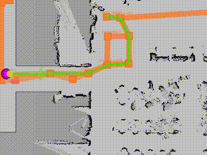
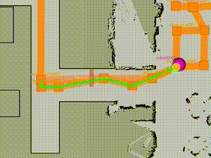
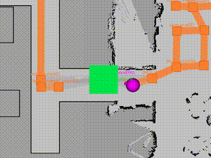

# rmf_resource_monitor

ROS 2 node for accessing a **Resource Management Server** and using its results for publishing obstacle information for the Open-RMF fleets to use.

## About Resource Management Server

Resource Management Server is a concept standardized by [RFA (Robot Friendly Asset Promotion Association)](https://robot-friendly.org/).

The server is responsible for managing the occupation status of the "resources (places that only one robot can pass at a time such as narrow aisles)" inside buildings. It is expected to serve as a bridge for sharing blockage information between separate robot fleets managed by separate systems (either based on Open-RMF or not).

Each robots trying to pass the resource are expected to "register" to the resource by accessing the server before entering the resource.  Information about the resource is expected to be shared beforehand to all fleet system managers by the Resource Management Server operator.

Such servers and agreements to use it are necessary because the robots working inside a certain building does not always belong to the same fleet management system.

In this repository, we provide a ROS 2 node that accesses the Resource Management Server and uses its results for publishing obstacle information for the Open-RMF fleets to use.

The following are some example movies showing RViz visualization of the obstacle information published by this node. 2 robots (both operated by separate Open-RMF systems) are trying to pass a "resource" (made to look like a narrow aisle).

The obstacle appears and the lanes are blocked for the robot on the right side when the other robot (the one coming from the left side) registers to the resource and disappears when the robot releases the resource.

<table>
  <tr>
    <td></td>
    <td></td>
  </tr>
  <tr>
    <td align="center">(RMF A) Nothing is shown when resource is successfully registered</td>
    <td align="center">(RMF B) Obstacle appears when registration fails</td>
  </tr>
  <tr>
    <td></td>
    <td></td>
  </tr>
  <tr>
    <td align="center">(RMF B) Obstacle disappears when registration succeeds</td>
    <td align="center">Actual Movement (White one works on RMF A, Black one on RMF B)</td>
  </tr>
</table>

## Related Repositories

- [rmf_obstacles](https://github.com/open-rmf/rmf_obstacle)

  Collection of ROS 2 packages for obstacle detection and publishing their info for the Open-RMF fleets to use.

- [resource_management_server](https://github.com/sbgisen/resource_management_server)

  Sample implementation of a Resource Management Server. Can be used for testing basic functionalities.

## Sample Experiment with Resource Management Server

### Preparation

#### Prepare Resource Management Server and its Configuration

Here we will use the sample implementation repository described above.
Follow the instructions written inside its [README](https://github.com/sbgisen/resource_management_server/blob/develop/README.md).

Note that the Resource Management Server is independent of the ROS 2 environment, including the map coordinates used by the Open-RMF system.

The config file created here will be referred to as **Config File A** hereinafter.

#### Create a Resource Configuration File

Next, create a list of the target building's resource info containing the Open-RMF's map coordinate based values of the resource positions. See [sample_resource_list.yaml](config/sample_resource_list.yaml) for an example. Make sure the `resource_id` values matches the ones used inside Config File A.

The configuration file created at this step will be used by the `rmf_resource_monitor` node and is tied with the Robot's fleet management system (which means that this file should differ among separate management systems).

The config file created here will be referred to as **Config File B** hereinafter.

>[!Note]
The actual definition of resources is yet to be defined by RFA. This configuration file is a temporary solution for testing purposes.

### Create a Parameter Configuration File

>[!Note]
Currently the `rmf_resource_monitor` node can handle only one robot at a time. Multiple nodes are necessary for multiple robots.

Create a settings file for the `rmf_resource_monitor` node. See [sample_rosparams.yaml](config/sample_rosparams.yaml) for an example.

Parameter explanations

- `robot_id`: The robot's ID. This should match the one used by the fleet management system (i.e. `name` value used to pass fleet states inside Open-RMF). Right now, this can be any string as long as it is unique among all systems using the same Resource Management Server. In real use cases, these IDs should be given by the Resource Management Server's administrator.

- `building_id`: The building's ID. Make sure it matches the one used for the targeted resources inside Config File A. The Resource Management Server will accept registrations only when the requested `building_id` and `resource_id` matches the one managed by the server. In real use cases, this should be an ID given by the Resource Management Server's administrator.

- `server_url`: The URL of the Resource Management Server. In real use cases, this should be an URL given by the Resource Management Server's administrator. Authentication is not supported yet.

- `resource_config_file`: The absolute path to Config File B.

- `resource_registration_distance`: The distance (meters) from the resource where the robot should register to the server. The robot will try to register to the server when it is within this distance from the resource. This should be set to a value that is appropriate for the robot's speed and the server's response time. Defaults to `3.4`.

- `resource_release_distance`: The distance (meters) from the resource where the robot should release the resource. The robot will release the resource when it is within this distance from the resource. This should be set to a value that is larger than `resource_registration_distance` to avoid the robot registering and releasing the resource repeatedly. Defaults to `4.0`.

- `block_on_failure`: If `true`, the node will publish obstacle message of the targeted resource when the robot cannot access the Resource Management Server. Defaults to `false`. This depends on whether you want to prevent the robot from passing the resource when the server is unaccessible.

The config file created here will be referred to as **Config File C** hereinafter.

### Prepare Open-RMF Traffic

TODO

### Add Lane Blocking Support to Fleet Adapter

The `lane_blocker_node` from the [rmf_obstacle](https://github.com/open-rmf/rmf_obstacle) repository will be responsible for publishing lane closure messages when obstacle messages are caught.

The lane request messages from the `lane_blocker_node` needs to be handled by your fleet's Fleet Adapter. Make sure to open and close lanes depending on the messages. See [this Fleet Adapter implementation](https://github.com/open-rmf/rmf_demos/blob/95b7335068bab6b31fcaeb6bdd582b2492fddfa0/rmf_demos_fleet_adapter/rmf_demos_fleet_adapter/fleet_adapter.py#L423-L495) for an example.

>[!Note]
Currently, the above implementation is usually not included in Fleet Adapters derived from the Open-RMF's [`fleet_adapter_template` package](https://github.com/open-rmf/fleet_adapter_template). The above is what we follow in our current implementation but there might be better ways to handle this.

### Clone and Build packages

```bash
cd ~/rmf_ws/src
git clone https://github.com/open-rmf/rmf_obstacle
git clone https://github.com/sbgisen/rmf_resource_monitor
# Run the following command if you are not using the OAK-D camera
# touch rmf_obstacle/rmf_human_detector_oakd/COLCON_IGNORE
cd ~/rmf_ws
rosdep install -yr --from-paths . --ignore-src
colcon build
source install/setup.bash
```

## Running the System

1. Run the Resource Management Server

    Make sure the machine running the server is accessible from the machine running the `rmf_resource_monitor` node.

    ```bash
    cd ~/workspace/resource_management_server/resource_management_server
    export RESOURCE_YAML_PATH=/path/to/config_file_A.yaml
    flask run --host=0.0.0.0 --port=5000
    ```

2. Launch your Open-RMF demo environment

    This depends on how you set up your Open-RMF environment. Make sure the robot's fleet management system is running.

3. Run the `lane_blocker_node`

    Run the `lane_blocker_node` if it is not launched at the previous step.

    ```bash
    ros2 run rmf_obstacle_ros2 lane_blocker_node --ros-args -p lane_closure_threshold:=1 -p speed_limit_threshold:=1 -p continuous_checker:=true
    ```

4. Run the `rmf_resource_monitor` node

    ```bash
    ros2 launch rmf_resource_monitor rmf_resource_monitor.launch.py param_file:=<path to Config File C>
    ```

5. Run whatever task available

    The following is an example line using the `dispatch_go_to_place` task from the [`rmf_demos_tasks` package](https://github.com/open-rmf/rmf_demos/tree/main/rmf_demos_tasks).

    ```bash
    ros2 run rmf_demos_tasks dispatch_go_to_place -p demo_target -R <robot_name> -F <fleet_name>
    ```

6. (For testing behaviors) Register to a resource using a dummy robot ID

    If you want to test a situation where another system/robot has registered a certain resource before your robot, you can use the following example command to register to a resource using a dummy robot ID. Replace server URL if necessary.

    ```bash
    curl -X POST http://127.0.0.1:5000/api/registration -H "Content-Type: application/json" -d '{
    "api": "Registration",
    "robot_id": "dummy_robot_id",
    "bldg_id" : "<building_id>",
    "resource_id": "<resource_id>",
    "timeout" : 0,
    "request_id": "12345",
    "timestamp": 1725962117942
    }'
    ```

    Make sure the `timestamp` value is the actual time or the request will be rejected. `request_id` can be any string.

    To unregister, wait until `max_expiration_time` for the resource passes or use the following command.

    ```bash
    curl -X POST http://127.0.0.1:5000/api/release -H "Content-Type: application/json" -d '{
    "api": "Release",
    "bldg_id" : "<building_id>",
    "robot_id": "dummy_robot_id",
    "resource_id": "<resource_id>",
    "timeout" : 0,
    "request_id": "12345",
    "timestamp": 1725962117942
    }'
    ```
